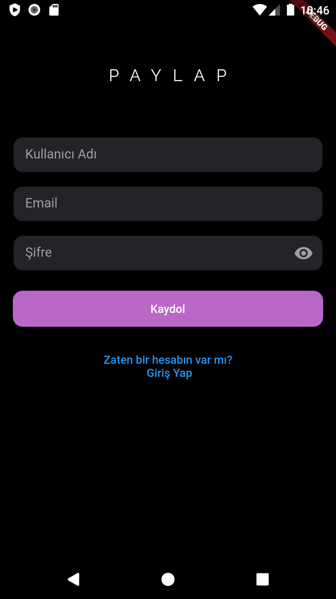

<!--  -->
# Nedir?
Paylap, kullanıcıların özgürce düşünücelerini ifade edebildiği, insanlarla etkileşime geçebileceği bir interaktif 
sosyal medya uygulamasıdır

## Kullanıcı Arayüzü
<!-- 
 -->
<!-- 

 -->

<div style="display:flex;">
    
    
</div>
<div style="display:flex;">
    
    
</div>
<div style="display:flex; justify-content: center;">
    
</div>

## Kurulum
```
git clone https://github.com/musa-c/3301456_223301108.git
```

## Kullanılan Teknolojileler
* [FLUTTER](https://flutter.dev/)
* [ASP.NET WEB API](https://learn.microsoft.com/en-us/aspnet/web-api/)
  * [API REPOM](https://github.com/musa-c/PaylapAPI-ASP.NET-Core-Web-Api)

### Backend Olmadan PlayStore'da!
[Paylap Play Store](https://play.google.com/store/apps/details?id=com.paylap.paylap)
